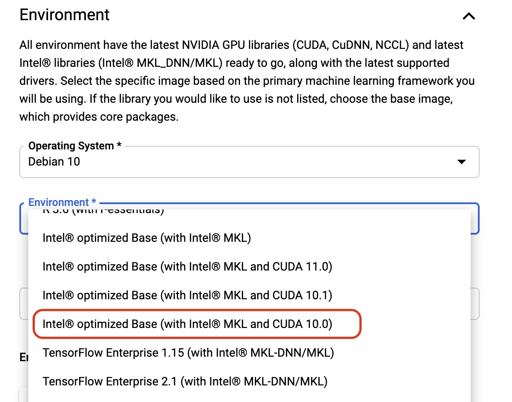

# Pretraining XLNet 

This repo contains a working notebook for you to be able to pretrain XLNet LM from scratch with relative ease using an AI Platform Notebook instance. 

## Dataset
We will be using Dialpad Support Calls are from `talkiq-data.ai_research.dialpad_support_call_transcripts`

## Setup & Installation

#### Create AI Platform Notebook:

1. Follow the instructions from the AI Platform notebook guide [here](https://docs.google.com/document/d/1bP7MHUs9D8c3oBc9xEcljLtHJhzNm-TveX0dp6q0D_4/edit?usp=sharing) with a necessary step below
    * **\*\*IMPORTANT**** Make sure to create an instance with **CUDA 10.0** installed. This can be done by selecting the following option when creating an instance
        * 
        
    * If not using AI Platform notebook, make sure your environment is setup with CUDA 10.0 and CuDNN 7.4 installed. 

2. Clone the repo:
    
    git clone https://github.com/matthiasdialpad/xlnet_pretrain.git

3. Next, install the necessary packages with:
    
    cd xlnet_pretrain
    pip install -r requirements.txt
   
Now, you should be able to run `lm_pretrain_v1.ipynb`

#### Overview to pretrain XLNet LM from scratch:
1. Decide on dataset you want to pretrain XLNet on 
2. Train SentencePiece tokenizer model on dataset (OR use an existing trained SentencePiece tokenizer model)
3. Process the dataset with the trained SentencePiece tokenizer using `xlnet/data_utils.py` 
4. We are now ready to pretrain an XLNet using `xlnet/train_gpu.py`

`train_sentencepiece.txt` is used when training a custom Sentence Piece tokenizer model

`lm_pretrain.txt` is used when pretraining a XLNet LM that is formatted according to the original author's recommendation. Specifically, this is their instruction:

The input text files to `data_utils.py` must use the following format:
* Each line is a sentence.
* An empty line means End of Document.
* (Optional) If one also wants to model paragraph structures, `<eop>` can be inserted at the end of certain lines (without any space) to indicate that the corresponding sentence ends a paragraph.

For example, the text input file could be:
```
This is the first sentence.
This is the second sentence and also the end of the paragraph.<eop>
Another paragraph.

Another document starts here.
```

`spiece.model` is the trained sentencepiece model, an output of `spm.SentencePieceTrainer.train()`. The `spiece.model` in `dialpad_xlnet_16000` is trained on dialpad data with a vocab size of 16,000 while the `spiece.model` in `dialpad_xlnet_320000` is the original model from the authors (same one used by HuggingFace)
``
## XLNet Folder - Changes/Fixes

This folder is cloned directly from XLNet author's [GitHub](https://github.com/zihangdai/xlnet) with some modifications

    git clone https://github.com/zihangdai/xlnet.git

* `data_utils.py` Added vocab_size to be a flag variable instead of being a fixed value. This `vocab_size` must be the same as the `vocab_size` when training a custom SentencePiece model 
* `modelling.py: bsz%2==0 -> tf.debugging.assert_equal(bsz % 2, 0)` This is because bsz in `relative_positional_encoding` is inferred from the shape of the input which makes it a tensor and % is for integers not tensors, so we use tf's assert_equal instead

## CUDA
1. Make sure you have a GPU that is available by using `nvidia-smi` in terminal
2. Make sure tensorflow recognizes ur GPU as well. You can do this with:
```    
    import tensorflow as tf
    if tf.test.gpu_device_name():
        print('Default GPU Device: {}'.format(tf.test.gpu_device_name()))
    else:
        print("Cannot recognize GPU")
```        